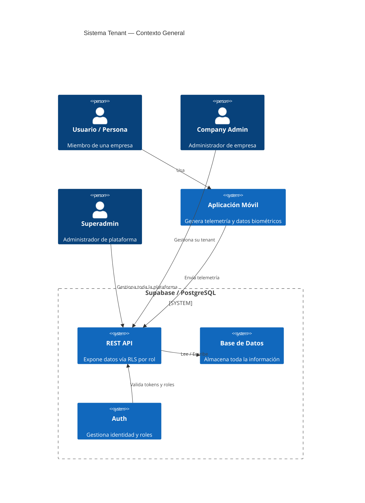
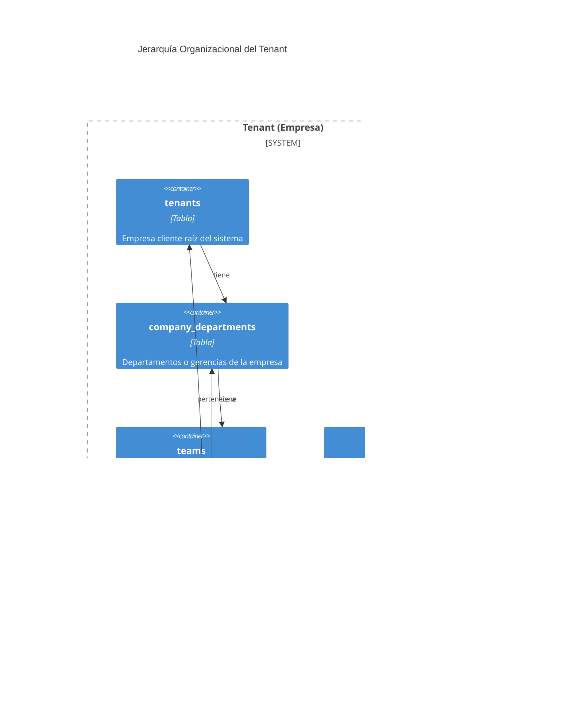
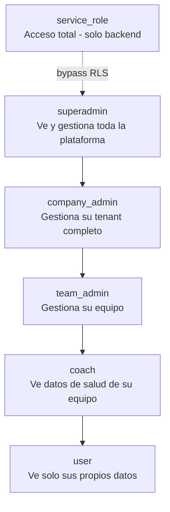
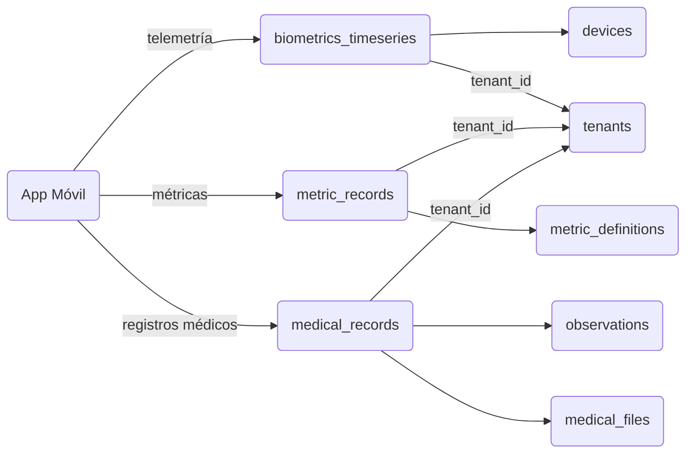

# Sistema Tenant — Documentación de Arquitectura

## 1. Visión General (Nivel C4 — Contexto)

El sistema está construido sobre una arquitectura **multi-tenant**, donde cada empresa
cliente es un `tenant` independiente. Los usuarios pertenecen a un tenant y tienen
un rol que determina qué datos pueden ver y gestionar.

---

## 2. Jerarquía Organizacional (Nivel C4 — Contenedor)

Cada tenant representa una empresa. Dentro de ella existe una jerarquía de
**departamento → equipo → célula → persona**.

---

## 3. Tablas del Sistema Tenant

### 3.1 `tenants`
Tabla raíz. Cada fila representa una empresa cliente independiente.
Casi todas las tablas del sistema tienen `tenant_id` como foreign key hacia esta tabla.

| Campo | Tipo | Descripción |
|-------|------|-------------|
| `id` | uuid | Identificador único del tenant |
| `name` | text | Nombre de la empresa |

**Políticas RLS:**
- Solo miembros del tenant pueden ver su propio tenant
- `service_role` tiene acceso total

---

### 3.2 `company_departments`
Representa las gerencias o departamentos dentro de una empresa.

| Campo | Tipo | Descripción |
|-------|------|-------------|
| `id` | uuid | Identificador único |
| `tenant_id` | uuid | FK → tenants |
| `name` | text | Nombre del departamento |

**Políticas RLS:**
- Cualquier miembro del tenant puede **ver** sus departamentos
- Solo `company_admin` y `superadmin` pueden **gestionar**

---

### 3.3 `teams`
Equipos dentro de un departamento.

| Campo | Tipo | Descripción |
|-------|------|-------------|
| `id` | uuid | Identificador único |
| `tenant_id` | uuid | FK → tenants |
| `department_id` | uuid | FK → company_departments |

**Políticas RLS:**
- Cualquier miembro del tenant puede **ver** los equipos
- Solo `company_admin` y `superadmin` pueden **gestionar**

---

### 3.4 `cells`
Subdivisiones dentro de un equipo.

| Campo | Tipo | Descripción |
|-------|------|-------------|
| `id` | uuid | Identificador único |
| `team_id` | uuid | FK → teams |

**Políticas RLS:**
- Cualquier miembro del tenant puede **ver** las células
- Solo `company_admin` y `superadmin` pueden **gestionar**

---

### 3.5 `tenant_memberships`
Tabla pivote clave. Vincula a un usuario con todos los niveles de la jerarquía
simultáneamente. Es el punto de entrada para resolver a qué empresa, departamento,
equipo y célula pertenece una persona.

| Campo | Tipo | Descripción |
|-------|------|-------------|
| `id` | uuid | Identificador único |
| `tenant_id` | uuid | FK → tenants |
| `department_id` | uuid | FK → company_departments |
| `team_id` | uuid | FK → teams |
| `cell_id` | uuid | FK → cells |
| `user_id` | uuid | FK → auth.users |
| `role` | app_role | Rol del usuario en este tenant |

**Políticas RLS:**
- El usuario ve solo su propia membresía
- `company_admin` ve todas las membresías de su tenant
- `superadmin` ve todo

---

## 4. Roles del Sistema

| Rol | Alcance | Puede gestionar |
|-----|---------|-----------------|
| `superadmin` | Toda la plataforma | Todo |
| `company_admin` | Su tenant | Departamentos, equipos, células, miembros |
| `team_admin` | Su equipo | Miembros del equipo |
| `coach` | Su equipo | Solo lectura de datos de salud |
| `user` | Solo sus datos | Sus propios registros |
| `service_role` | Todo (bypass RLS) | Procesos backend / ETL |

---

## 5. Flujo de Datos de Telemetría

---

## 6. Notas y Deuda Técnica

> ⚠️ **Sistema dual:** Existen dos jerarquías paralelas en la base de datos.
> El sistema `ios_teams / organizations` (legacy) y el sistema `tenants / company_departments`
> (principal). Antes de escalar la reportería conviene confirmar si se van a unificar.

> ⚠️ **Reports con `user_id NULL`:** Cualquier miembro del tenant puede ver reportes
> sin dueño asignado. Revisar si esto es intencional.

> ✅ **`service_role` para ETL:** El pipeline Bronze → Silver → Gold debe usar
> exclusivamente la `service_role key` para bypasear RLS y acceder a todos los datos.