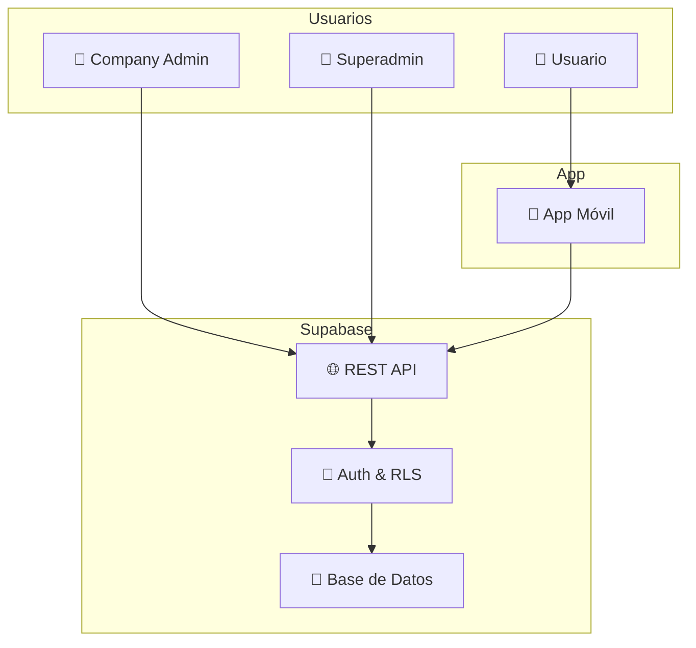
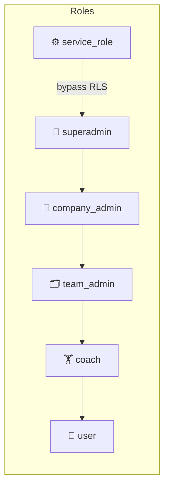

# Sistema Tenant — Documentación de Arquitectura

## 1. Contexto General

El sistema es **multi-tenant**: cada empresa cliente es un `tenant` independiente.
Los usuarios pertenecen a un tenant y tienen un rol que determina qué datos pueden ver.


---

## 2. Jerarquía Organizacional

Dentro de cada tenant existe una jerarquía de cuatro niveles.
`tenant_memberships` es la tabla pivote que une a una persona con toda la jerarquía.
```mermaid
flowchart TD
    subgraph Tenant 🏢
        T[🏢 tenants]
        CD[🏛️ company_departments]
        TM[👥 teams]
        C[🔬 cells]
        MEM[👤 tenant_memberships]
    end

    T --> CD
    CD --> TM
    TM --> C
    MEM --> T
    MEM --> CD
    MEM --> TM
    MEM --> C
```

---

## 3. Roles y Permisos


| Rol | Alcance | Acción |
|-----|---------|--------|
| `superadmin` | Toda la plataforma | Gestiona todo |
| `company_admin` | Su tenant | Gestiona depto, equipos, células |
| `team_admin` | Su equipo | Gestiona miembros |
| `coach` | Su equipo | Solo lectura de salud |
| `user` | Sus datos | Sus propios registros |
| `service_role` | Todo | Bypass RLS — solo backend |

---

## 4. Flujo de Datos de Telemetría
```mermaid
flowchart LR
    subgraph Origen
        APP[📱 App Móvil]
    end

    subgraph Legacy 🟠
        AHB[🍎 apple_health_body]
        DA[🏃 daily_activity]
        CS[📊 calculated_scores]
        HV[📐 hard_variables]
        MM[🦵 mobility_metrics]
        SS[🧠 smart_score]
    end

    subgraph Tenant Principal 🟢
        BIO[📡 biometrics_timeseries]
        BM[📏 body_measurements]
        MED[🩺 medical_records]
        MR[📈 metric_records]
    end

    APP --> AHB
    APP --> DA
    APP --> CS
    APP --> BIO
    APP --> MED
```

---

## 5. Estado Actual de los Datos
```mermaid
flowchart TD
    subgraph Sistema Legacy 🟠 activo
        AHB[🍎 apple_health_body 14]
        DA[🏃 daily_activity 261]
        CS[📊 calculated_scores 1109]
    end

    subgraph Sistema Tenant 🔵 vacío
        BIO[📡 biometrics_timeseries 0]
        BM[📏 body_measurements 0]
        MED[🩺 medical_records 0]
        MR[📈 metric_records 0]
    end

    subgraph DW Pipeline
        BR[🥉 Bronze]
        SI[🥈 Silver]
        GO[🥇 Gold]
    end

    AHB --> BR
    DA --> BR
    CS --> BR
    BR --> SI
    SI --> GO
```

---

## 6. Tablas del Sistema Tenant

### 6.1 `tenants` 🏢
Tabla raíz. Cada fila es una empresa cliente independiente.
Casi todas las tablas tienen `tenant_id` como foreign key hacia aquí.

| Campo | Tipo | Descripción |
|-------|------|-------------|
| `id` | uuid | Identificador único |
| `name` | text | Nombre de la empresa |

---

### 6.2 `company_departments` 🏛️
Gerencias o departamentos dentro de una empresa.

| Campo | Tipo | Descripción |
|-------|------|-------------|
| `id` | uuid | Identificador único |
| `tenant_id` | uuid | FK → tenants |
| `name` | text | Nombre del departamento |

---

### 6.3 `teams` 👥
Equipos dentro de un departamento.

| Campo | Tipo | Descripción |
|-------|------|-------------|
| `id` | uuid | Identificador único |
| `tenant_id` | uuid | FK → tenants |
| `department_id` | uuid | FK → company_departments |

---

### 6.4 `cells` 🔬
Subdivisiones dentro de un equipo.

| Campo | Tipo | Descripción |
|-------|------|-------------|
| `id` | uuid | Identificador único |
| `team_id` | uuid | FK → teams |

---

### 6.5 `tenant_memberships` 👤
Tabla pivote. Vincula a un usuario con todos los niveles de la jerarquía.

| Campo | Tipo | Descripción |
|-------|------|-------------|
| `id` | uuid | Identificador único |
| `tenant_id` | uuid | FK → tenants |
| `department_id` | uuid | FK → company_departments |
| `team_id` | uuid | FK → teams |
| `cell_id` | uuid | FK → cells |
| `user_id` | uuid | FK → auth.users |
| `role` | app_role | Rol del usuario en este tenant |

---

## 7. Notas y Deuda Técnica

> ⚠️ **Sistema dual:** Existen dos jerarquías paralelas. El sistema `ios / organizations`
> (legacy) concentra todos los datos actuales. El sistema `tenants` está diseñado pero vacío.
> Confirmar con el equipo si habrá migración.

> ⚠️ **Reports con `user_id NULL`:** Cualquier miembro del tenant puede ver reportes sin
> dueño asignado. Revisar si es intencional.

> ✅ **ETL hacia el DW:** Usar exclusivamente `service_role key` para bypasear RLS
> y acceder a todos los datos en el pipeline Bronze → Silver → Gold.